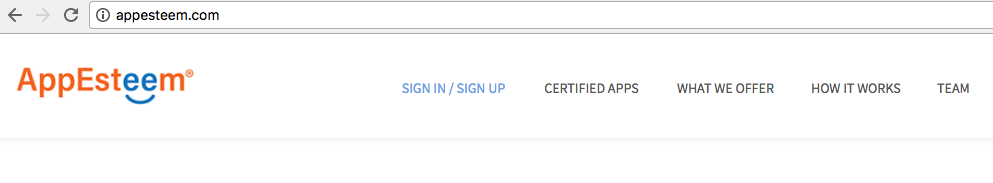
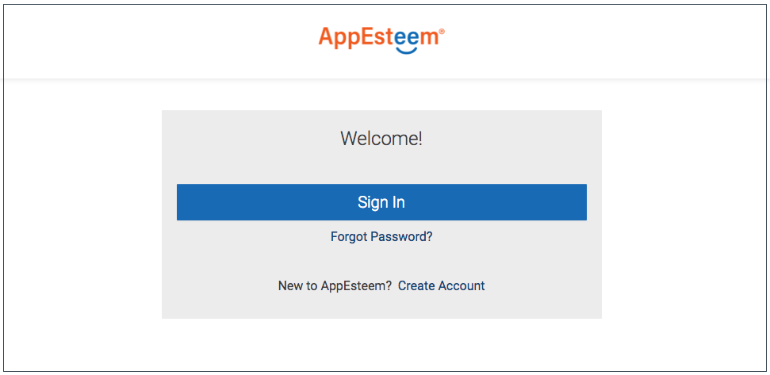
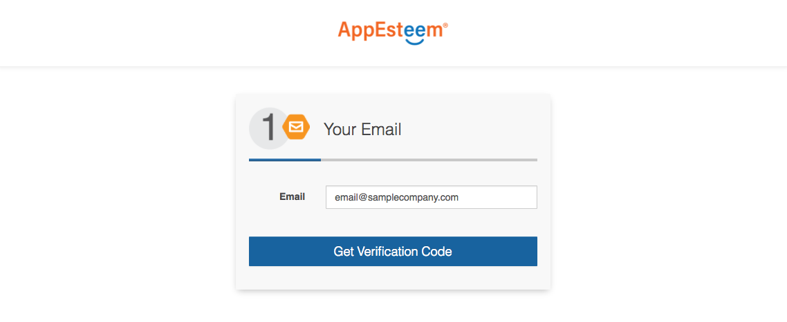
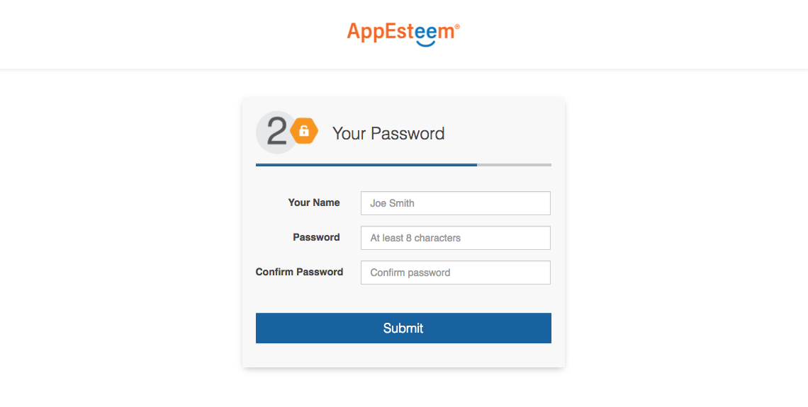
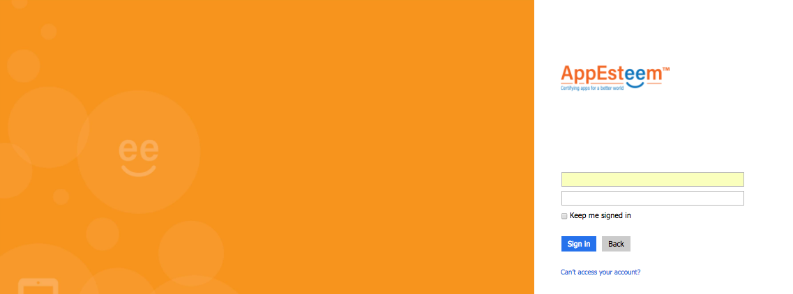

# Create an account for the AppEsteem® customer portal

In order to perform any operations on the AppEsteem customer portal, an account must first be created. The following steps will create a customer account that is linked to you email address.

1. Log in to the AppEsteem portal. Navigate to <http://appesteem.com> and click on the 
"Log in" navigation menu link

    

2. You will next be presented with the AppEsteem sign in page. If you already have an AppEsteem account, click on the Sign In button and sign in with email and password you used to register with AppEsteem. If you do not have an account, click on **Create Account** at the bottom of the page

    

3. Clicking on **Create Account** will present you with a prompt for your email. Enter your email address and click the **Get Vertification Code** button. The email address is used to identify you to the AppEsteem customer portal. Enter an email address where you receive email as a verification code will be sent to this email address and you must be able to enter this code into the next page

    

4. After a few moments, please check your email for the verification code sent from AppEsteem. Enter the Verification Code you received by email and click the Verify button. Once the code has been verified, you'll be advanced to the next page

    

5. Enter Your Name, Password, Confirm Password and click the **Submit** button. When both passwords match, you will be directed to the signing page.

    

6. Sign in with email and password you used to register with AppEsteem.

    
