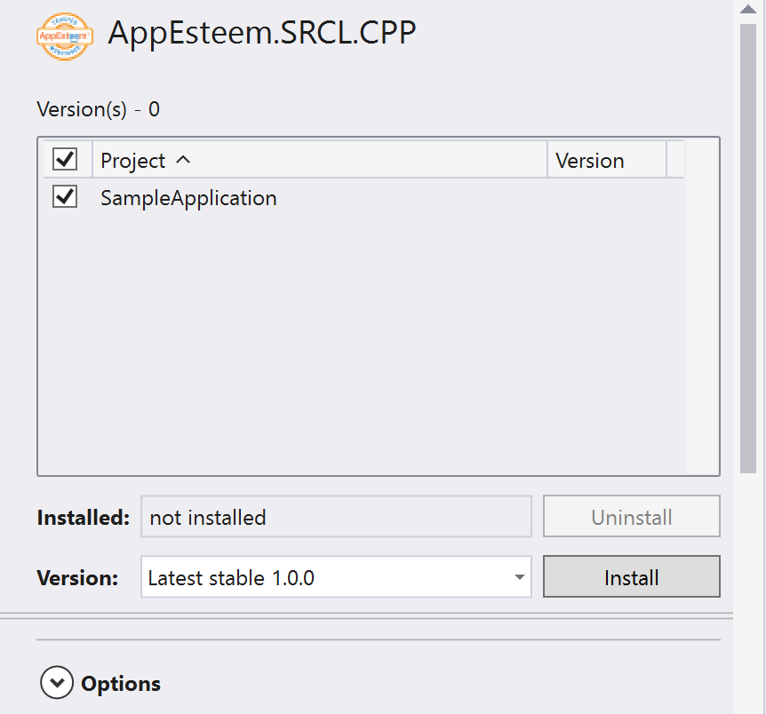
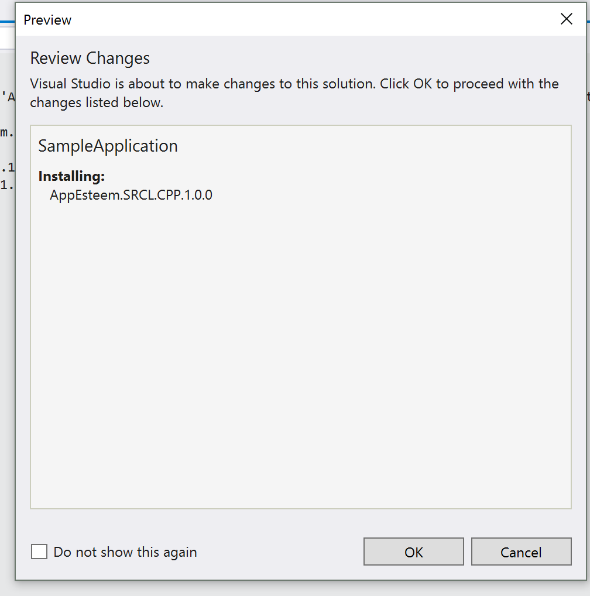
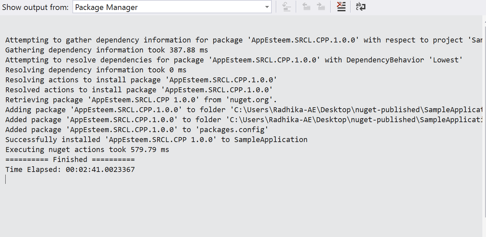
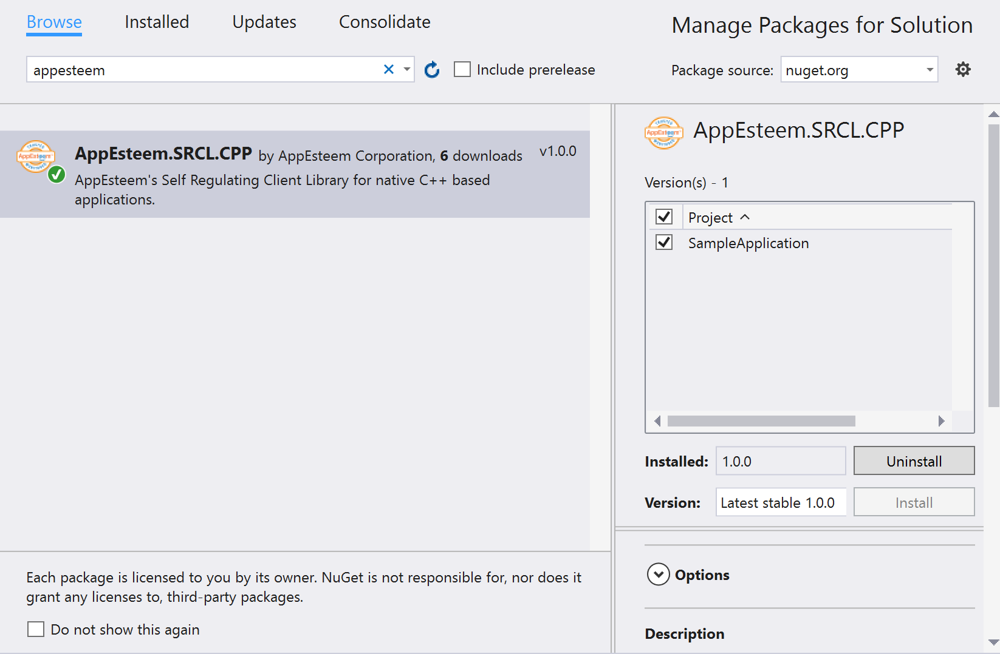

# .NET SRCL Samples

This repository contains samples showing how to use the SRCL library from a managed C# application.
## Please follow instrustions below to link srcl to the application.
# 
_**Obtaining Seal from AppEsteem**_
1) Login to AppEsteem portal <https://customer.appesteem.com/>
2) Register your application. 
3) After successful registration seal will be provided from AppEsteem.

_**Downloading AppEsteem SRCL Library**_
1) From visual studio select menu Tools -> NuGet Package Manager ->
 Manage Nuget Package for solution.
2) Select Browse and search for appesteem.You should be able to see AppEsteem.SRCL.CSharp listed.
 
3) Select the application to be linked to AppEsteem SRCL Library and click install button.

    
5) A screen will be displayed to Review changes and to proceed with installation.

    
6) Select OK button to continue.
7) We can now see the message on the screen that the installation is  finished.

    
8) From NuGet package solution we can now see the AppEsteem SRCL checked and uninstall button enabled.

    
9) Modify your main function to be wrapped within the initialization object by doing:
        static int Main(string[] args)
        {
            using (var srcl = new SRCL.Init())
            {
                // Your main function code goes here...
            }
        }
10) Include the seal(AESEAL.json) obtained from AppEsteem to the application as embedded resource.
11) Ensure the users of your program have the Visual C++ redistributable run time components for the Visual Studio version you are using.
11) Build the application with seal included.
12) Application has to be build successfully.
13) Now when the application is run SRCL library should be able to send notifications/Telemetry to  the server.
