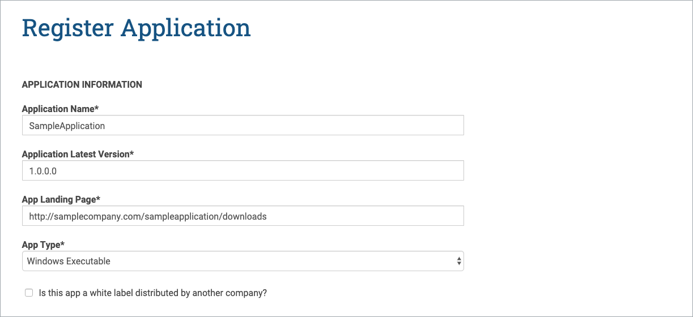

# .NET SRCL Samples

This repository contains samples showing how to use the SRCL library from a managed C# application.
## Please follow instrustions below to link srcl to the application.
# 
_**Obtaining Seal from AppEsteem**_
1) Login to AppEsteem portal <https://customer.appesteem.com/>
2) Register your company (you only need to do it once) :
* Click REGISTER button on the "You do not have any Company registered" banner. 

* Enter company Name and Website. Click Register button. Upon successful registration you will be navigated to AppEsteem Portal page.

3) Register your application:
* Under COMMIT click on “Manage my apps”.

* There are two ways to start application registration:
  - If this is your first application you will see the banner "No apps have been registered for Sample Company". Click on ADD NEW APP button.

  

  - Othervise you will see the list of registered applications. Click on the "+" button.

  

* Enter Application Name and Application Type and click Submit button.

* After successful registration you will see "Success!" message. Click on "Manage your applications" link.

* Registered application will appear in "Apps In Development" table.

4) Request an AppEsteem seal by clicking on the “Request Seal” button for desired application. This will generate an email to AppEstseem.
5) You will receive an email from AppEsteem requesting additional information about the application within 2 business days.
6) After receiving all the necessary information AppEsteem will provide you the seal (AESEAL.json).

_**Downloading AppEsteem SRCL Library**_
1) From Visual Studio select menu Tools -> NuGet Package Manager ->
 Manage NuGet Package for Solution.
2) Select Browse and search for appesteem.You should be able to see AppEsteem.SRCL.CSharp listed.

 

3) Select the application to be linked to AppEsteem SRCL Library and click Install button.

4) A screen will be displayed to Review changes and to proceed with installation.

5) Select OK button to continue.

6) Message is displayed on the screen that the installation is  finished.

7) From NuGet package solution innstallation can be verified with AppEsteem SRCL checked and Uninstall button enabled.

8) Modify your main function to be wrapped within the initialization object by doing:
      
        static int Main(string[] args)
        {
            using (var srcl = new SRCL.Init())
            {
                // Your main function code goes here...
            }
        }

  

9) Include the seal (AESEAL.json) obtained from AppEsteem to the application as Embedded Resource.

10) In your projects you must correctly set the value of assembly ,version and company in AssemblyInfo.cs. Alternatively you may use a version Win32 resource with valid "OriginalFilename", "ProductVersion" and "CompanyName". This information is required, either in the assembly configuration or Win32 resources and must match the information you provided when requesting the seal.

11) Ensure the users of your program have the Visual C++ Redistributable run time components for the Visual Studio version you are using.

12) Build the application with seal included.

13) Now when the application is run SRCL library should be able to send notifications/telemetry to  the server.