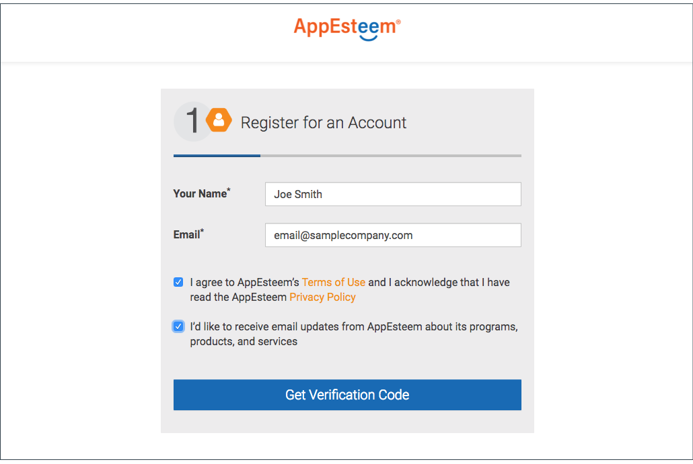
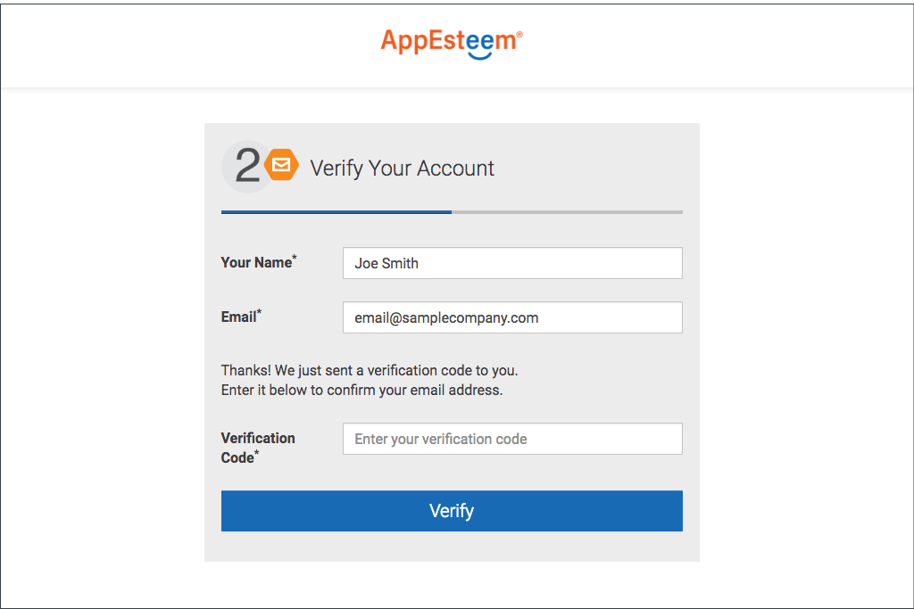
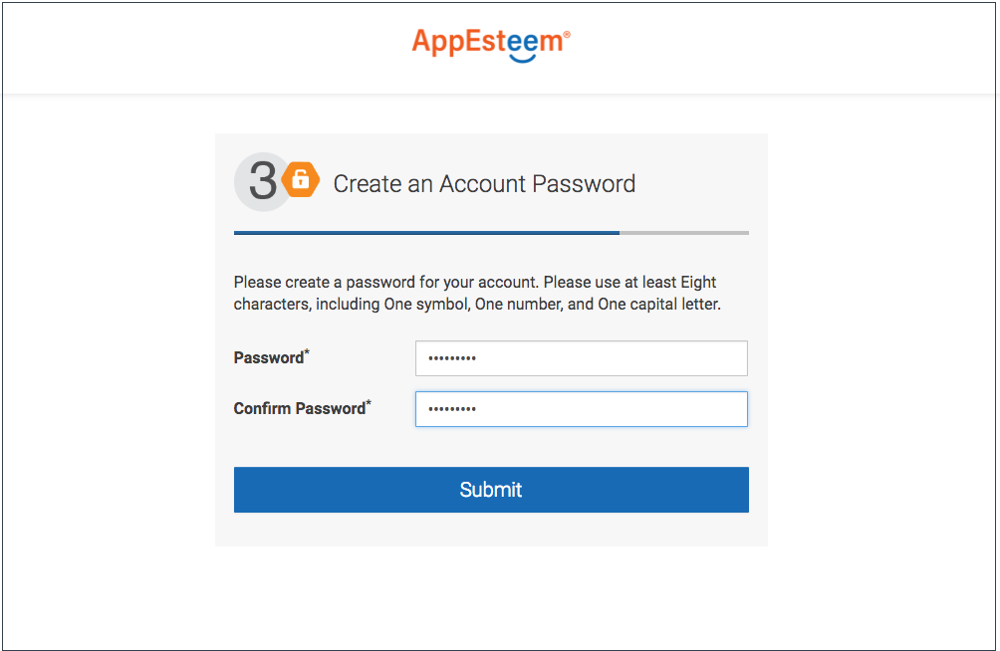
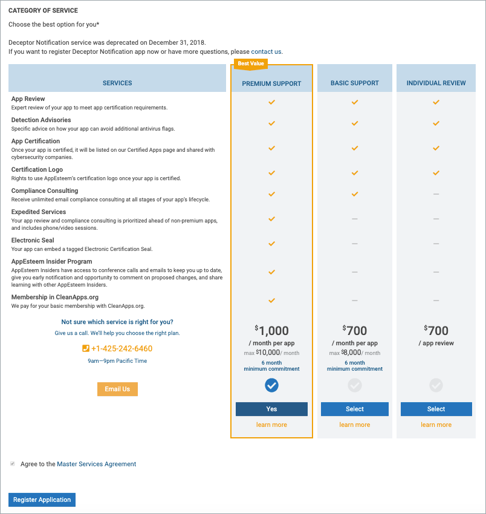

# .NET SRCL Samples

This repository contains samples showing how to use the SRCL library from a managed C# application.
## Please follow the instructions below to link SRCL to the application.
# 
_**Obtaining Seal from AppEsteem**_
1) Log in to the AppEsteem portal
* Go to <http://appesteem.com> and click on the 
"SIGN IN / SIGN UP" navigation menu link.

* If you already have an AppEsteem account, click the Sign In button and sign in with email and password you used to register with AppEsteem.

* If you do not have an AppEsteem account, create it:
    
    - Click on the Create Account link.
    - Enter your Email address and click the Get Verification Code button.

    

    - Enter the Verification Code you received by email and click the Verify button.

    

    - Enter Your Name, Password, Confirm Password and click the Submit button.

    

* Sign in with email and password you used to register with AppEsteem.

    

2) Register your company (you only need to do it once) :
* Click the REGISTER button on the "You do not have any Company registered" banner. 

* Enter the company Name and Website. Click the Register button. Upon successful registration you will be navigated to the AppEsteem Portal page.

3) Register your application:
* Under COMMIT click on “Manage my apps”.

* There are two ways to start the application registration:
  - If this is your first application you will see the banner "No apps have been registered for Sample Company". Click the ADD NEW APP button.

  

  - Othervise you will see the list of registered applications. Click the "+" button.

  

* Enter Application Name and Application Type and click the Submit button.

* After the successful registration you will see the "Success!" message. Click on the "Manage your applications" link.

* The registered application will appear in the "Apps In Development" table.

4) Request the application-specific AppEsteem seal by clicking on the “Request Seal” button. This will generate an email to AppEstseem.
5) You will receive an email from AppEsteem requesting additional information about the application within 2 business days.
6) After receiving all the necessary information AppEsteem will provide you the seal (AESEAL.json).

_**Downloading AppEsteem SRCL Library**_
1) From Visual Studio select menu Tools -> NuGet Package Manager ->
 Manage NuGet Package for Solution.
2) Select Browse and search for appesteem.You should be able to see AppEsteem.SRCL.CSharp listed.

 

3) Select the application to be linked to AppEsteem SRCL Library and click the Install button.

4) A screen will be displayed to Review changes and to proceed with installation.

5) Click OK to continue.

6) A success message will appear in the output window.

7) Modify your main function to be wrapped within the initialization object by doing:
      
        static int Main(string[] args)
        {
            using (var srcl = new SRCL.Init())
            {
                // Your main function code goes here...
            }
        }

  

8) Add the seal (AESEAL.json) obtained from AppEsteem to the application as Embedded Resource.

   * To do this select project right click -> go to properties -> select Resources tab -> from Add Resource choose Add Existing File and Select AESEAL.json File.

  
   
   * Now from AESEAL.json file properties select the Build Action as Embedded Resouce.

 

*Note: If AESEAL.json file is not correctly included and Embedded application might crash. If you notice crash make sure seal is properly embedded to your application.*

9) In your projects you must correctly set the value of assembly, version and company in AssemblyInfo.cs. Alternatively you may use a version Win32 resource with valid "OriginalFilename", "ProductVersion" and "CompanyName". This information is required, either in the assembly configuration or Win32 resources and must match the information you provided when requesting the seal.

10) Ensure the users of your program have the Visual C++ Redistributable run time components for the Visual Studio and OS versions you are using.

11) Build the application with the seal included.

12) Now when the application is run, the SRCL library should be able to send notifications/telemetry to the AppEsteem server.