### How to use AppEsteem's Self Regulating Client Library
**Pre requisites:** *Visualstudio_ 2010* and *later*

> Please follow instructions below to download and link vendor application to SRCL library:

_**Obtaining Seal from AppEsteem**_
1) Log in to the AppEsteem portal
* Go to <http://appesteem.com> and click on the 
"SIGN IN / SIGN UP" navigation menu link.

* If you already have an AppEsteem account, click on the Sign In button and sign in with email and password you used to register with AppEsteem.

* If you do not have an AppEsteem account, create it:
    
    - Click on the Create Account link.
    - Enter your Email address and click the Get Verification Code button.

    

    - Enter the Verification Code you received by email and click the Verify button.

    

    - Enter Your Name, Password, Confirm Password and click the Submit button.

    

* Sign in with email and password you used to register with AppEsteem.

    

2) Register your company (you only need to do it once) :
* Click the Provide Company Info button under the "We need your Company Information" message. 

* Enter the company Name, Website, Phone and Major Brands.

* Choose Commitment Level and click the Register button. Upon successful registration you will be navigated to the AppEsteem Portal page.

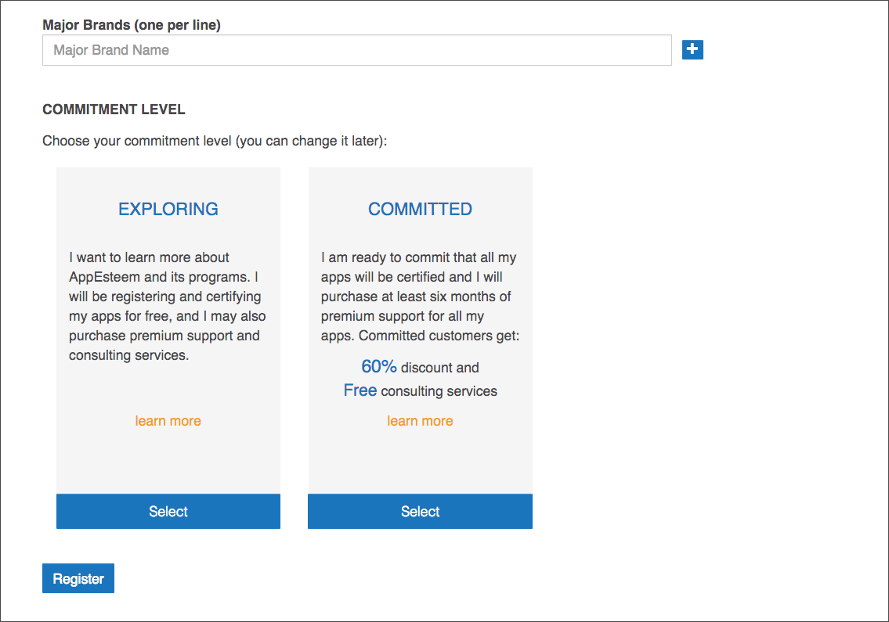

3) Sign the AppEsteem Certification Agreement:

* Under Agreements click on “Agree to the Certification Agreement”.

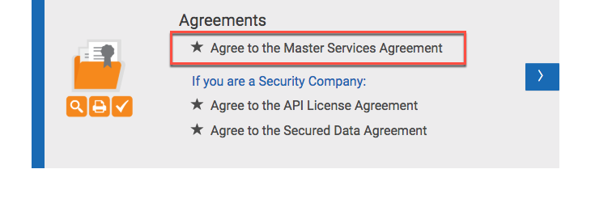

* Read the Certification Agreement by clicking on the Certification Agreement link, check the "I agree with the Certification Agreement" checkbox and click the Next button.

* Upon successfully signed the Certification Agreement you will see the check mark next to the "Agree to the Certification Agreement” link on the Portal page.

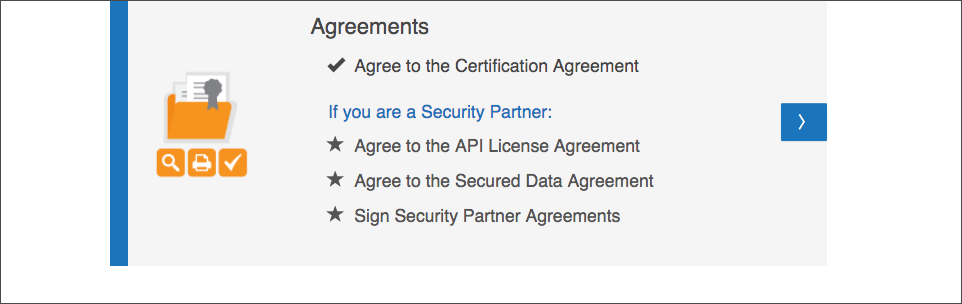

4) Register your application:

* There are two ways to start the application registration:
  - If this is your first application click the “Register an App” button on the portal home page.

  

  - Othervise click the See All Apps button (or click the ">" button for Applications under the THINGS YOU CAN DO section).You will see the list of registered applications. Click on the Register an App button.
  
  

  

* Enter Application Name, Application Landing Page and Application Type.

* Next step depends on the commitment level of your company:
  - If your company has "Explore" commitment level, you will see three categories of service. Choose Premium Support by clicking the Select button under the PREMIUM SUPPORT. Check the agree checkbox and click the Register Application to continue registration.

  

  - If your company has "Committed" commitment level, you will see only one category of service - Premium support. Click the Register Application button to continue registration.
  
  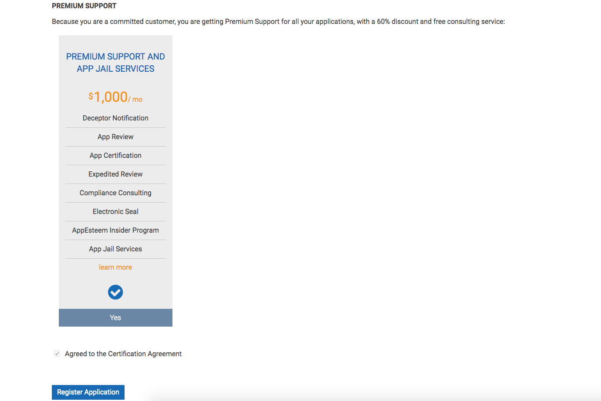

* Enter application version and click on the Next button.

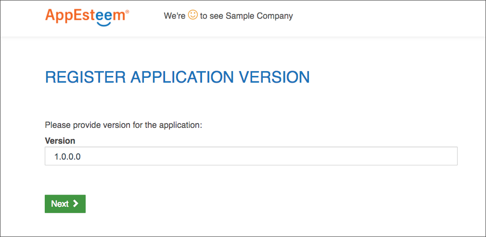

* Request Application Certification:
  - Upload application executables and click the Next button.

  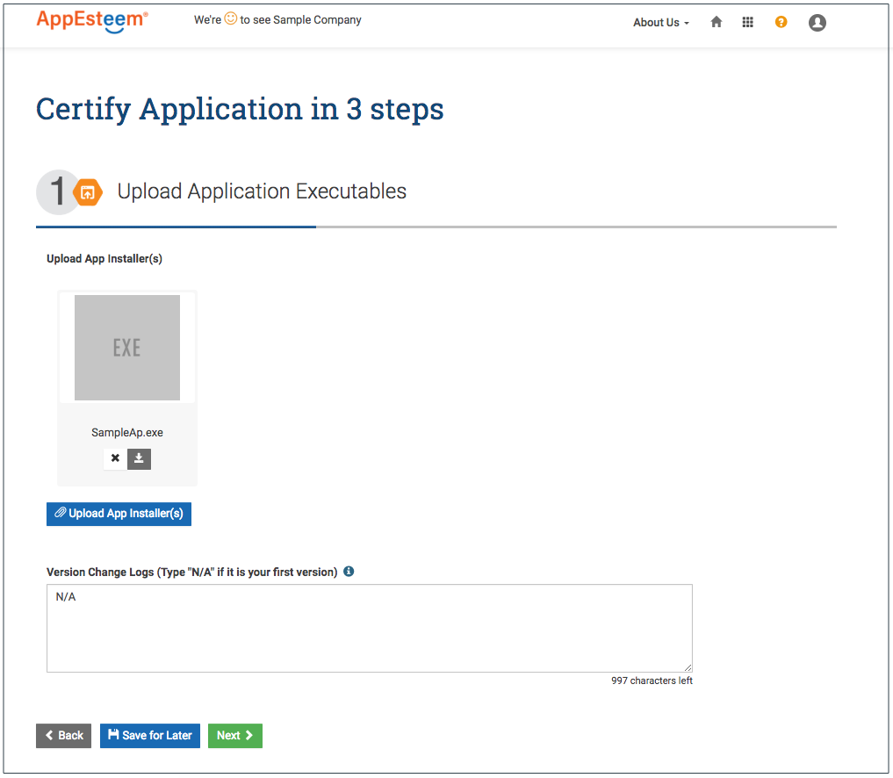

  - Provide application information and click on the Next button.
  
  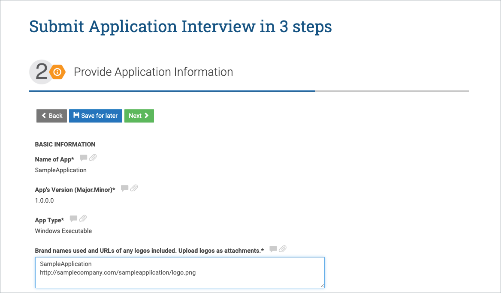

  ...

  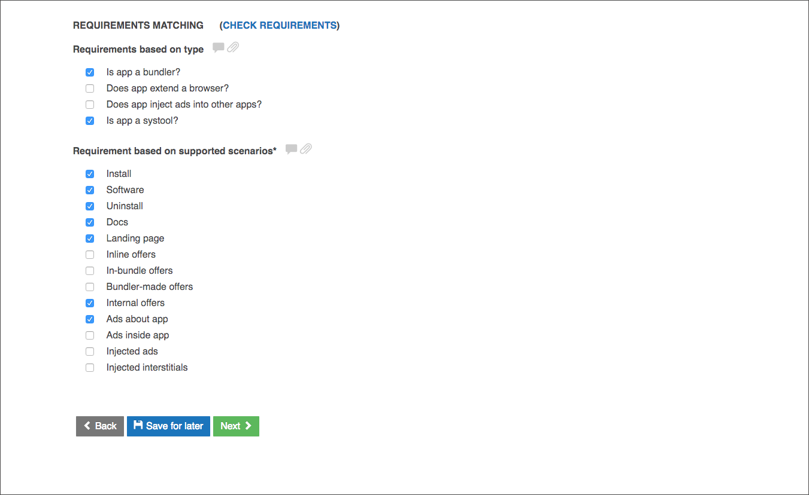

  - Check checkboxes for Attestation, enter your Name and clcik the Submit button.
  
  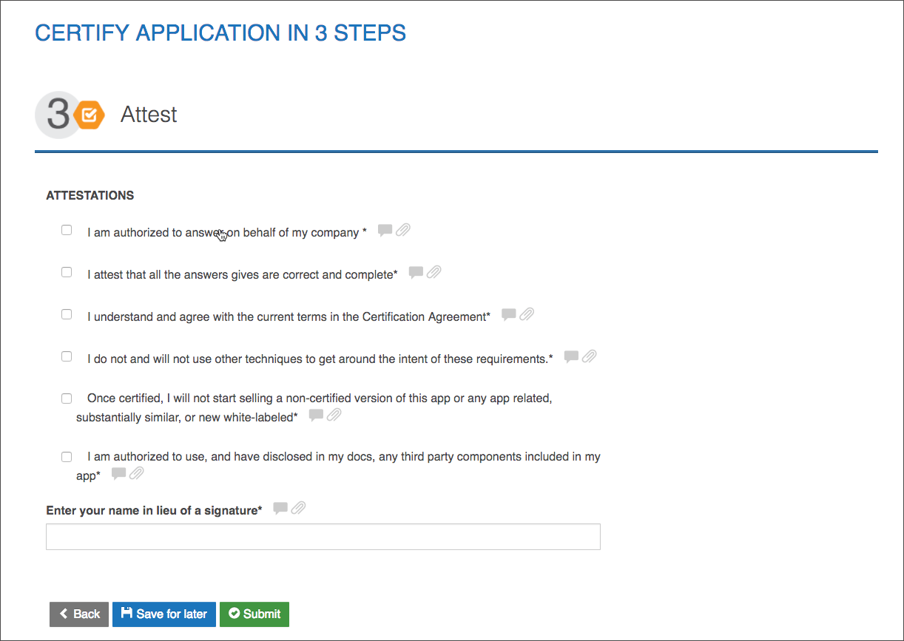

  - NOTE: At any step of the Request Application Certification, you can click the Save for later button. To resume the Certification later you would need to go to the Application List page and click the Request Certification link for the correspondent application version.
  
  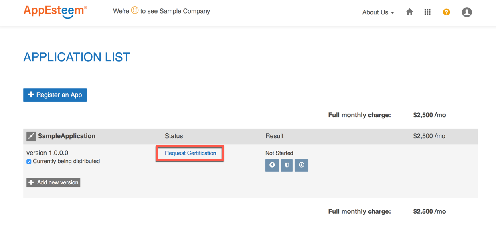

* After the successful registration you will be redirected to the Application List page. The registered application will appear in this list.

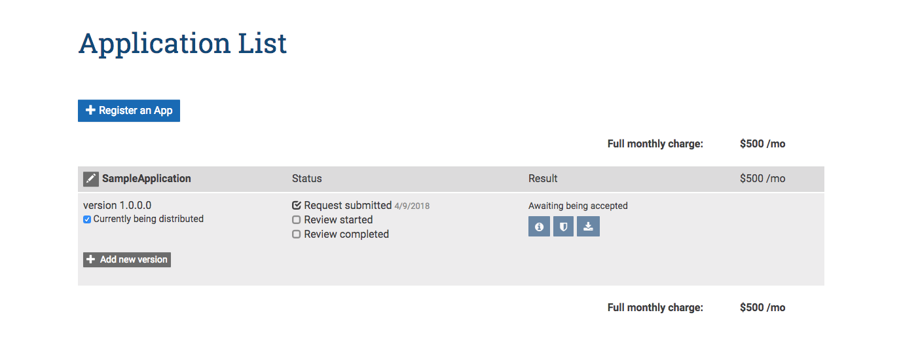

5) After the certification is successfully completed you can request the application-specific AppEsteem seal by clicking on the Shield icon (which now will be enabled). This will generate an email to AppEstseem.

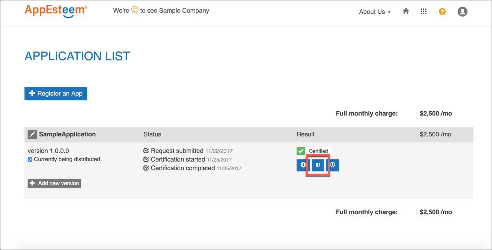

6) You will receive an email from AppEsteem requesting additional information about the application within 2 business days.
7) After receiving all the necessary information AppEsteem will provide you the seal (registration.cpp).

_**Downloading AppEsteem SRCL Library**_
1) From visual studio select menu Tools -> NuGet Package Manager ->
 Manage Nuget Package for solution.
2) Select Browse and search for appesteem.You should be able to see AppEsteem.SRCL.CPP listed.

    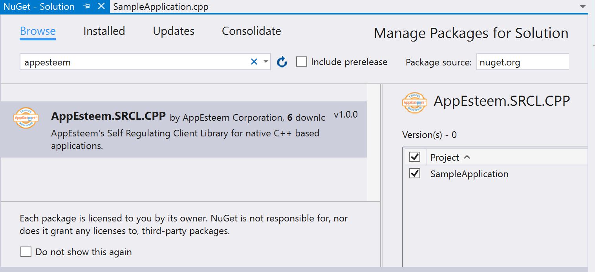
3) Select the application to be linked to AppEsteem SRCL Library and click install button.

    
5) A screen will be displayed to Review changes and to proceed with installation.

    
6) Select OK button to continue.
7) We can now see the message on the screen that the installation is  finished.

    
8) From NuGet package solution we can now see the AppEsteem SRCL checked and uninstall button enabled.

    
9) Include the seal(registration.cpp) obtained from AppEsteem to the application source files.
10) Build the application with seal included.
11) Now when the application is run SRCL library should be able to send notifications/Telemetry to  the server.

*Known issues:*

 1) Error while building your application :
"unexpected end of file while looking for while looking for precompiled header". 

    *Steps to resolve:* If you are using precompiled headers in your project, configure precompiled headers not using Precompiled Headers.
 _To do this go to Visual studio Solution Explorer right click on your application and select properties -> C++ tab -> Precompiled Headers -> Precompiled Header and select Not Using Precompiled Headers._

 **Steps to uninstall SRCL Library**

1) From visual studio select menu Tools -> NuGet Package Manager ->
 Manage Nuget Package for solution.

2) Select Installed option and then select   AppEsteem.SRCL.CPP listed. 
    
3) Select the application linked to AppEsteem SRCL Library and click uninstall button.

    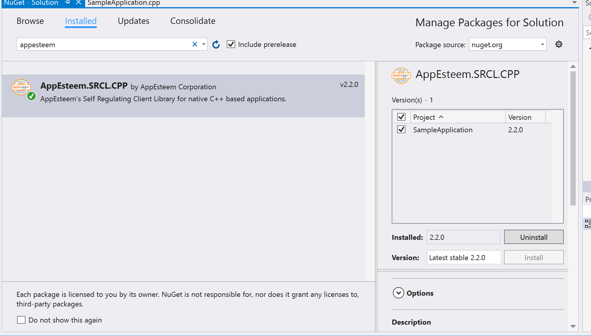
    
4) A screen will be displayed to Review changes and to proceed with uninstallation.

    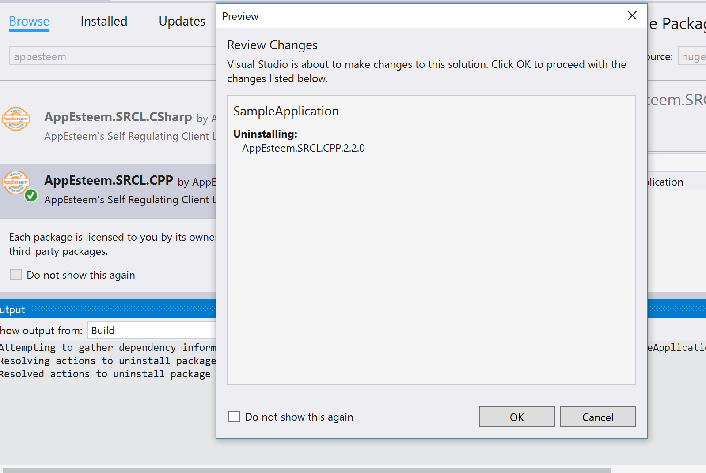
6) Select OK button to continue.
7) We can now see the message on the screen that the uninstallation is  finished.

    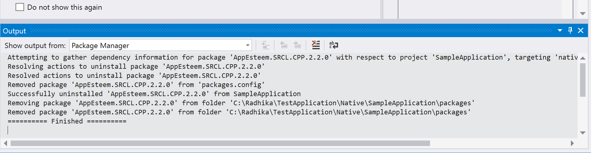