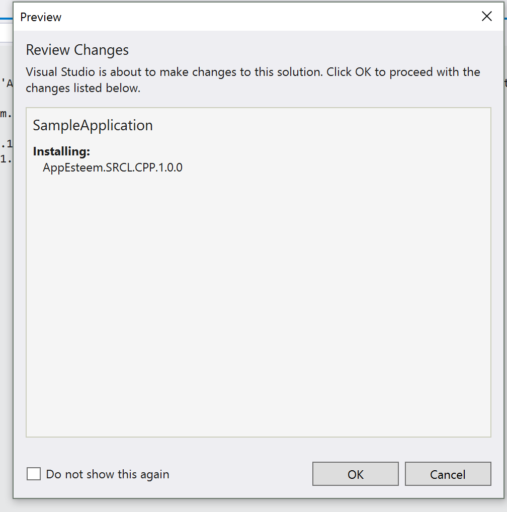
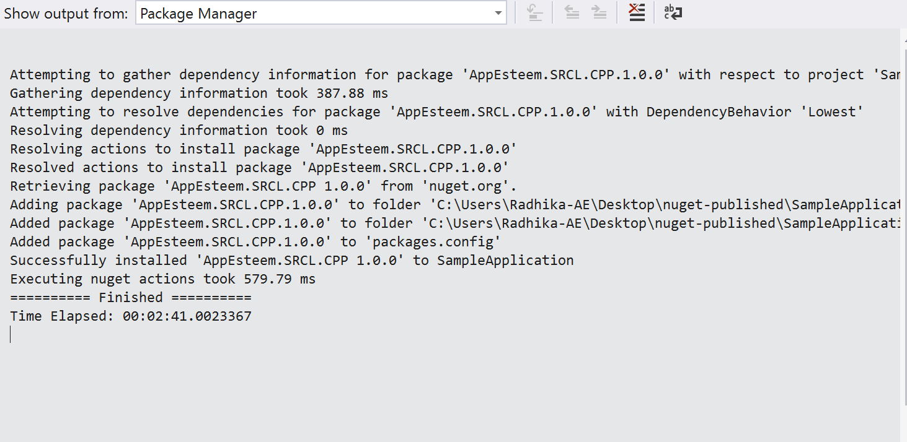

### How to use AppEsteem's Self Regulating Client Library
**Pre requisites:** *Visualstudio_ 2010* and *later*

> Please follow instructions below to download and link vendor application to SRCL library:

_**Obtaining Seal from AppEsteem**_
1) Login to AppEsteem portal <https://customer.appesteem.com/>
2) Register your application. 
3) After successful registration seal will be provided from AppEsteem.

_**Downloading AppEsteem SRCL Library**_
1) From visual studio select menu Tools -> NuGet Package Manager ->
 Manage Nuget Package for solution.
2) Select Browse and search for appesteem.You should be able to see AppEsteem.SRCL.CPP listed.

    
3) Select the application to be linked to AppEsteem SRCL Library and click install button.

    
5) A screen will be displayed to Review changes and to proceed with installation.

    
6) Select OK button to continue.
7) We can now see the message on the screen that the installation is  finished.

    
8) From NuGet package solution we can now see the AppEsteem SRCL checked and uninstall button enabled.

    
9) Include the seal(registration.cpp) obtained from AppEsteem to the application source files.
10) Build the application with seal included.
11) Now when the application is run SRCL library should be able to send notifications/Telemetry to  the server.

*Known issues:*

 1) Error while building your application :
"unexpected end of file while looking for while looking for precompiled header". 

    *Steps to resolve:* If you are using precompiled headers in your project, configure precompiled headers not using Precompiled Headers.
 _To do this go to Visual studio Solution Explorer right click on your application and select properties -> C++ tab -> Precompiled Headers -> Precompiled Header and select Not Using Precompiled Headers._