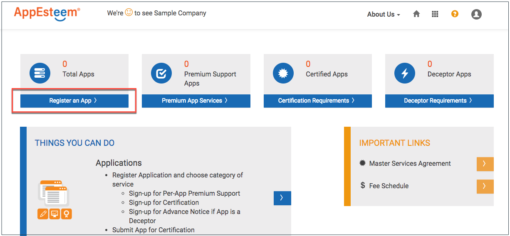
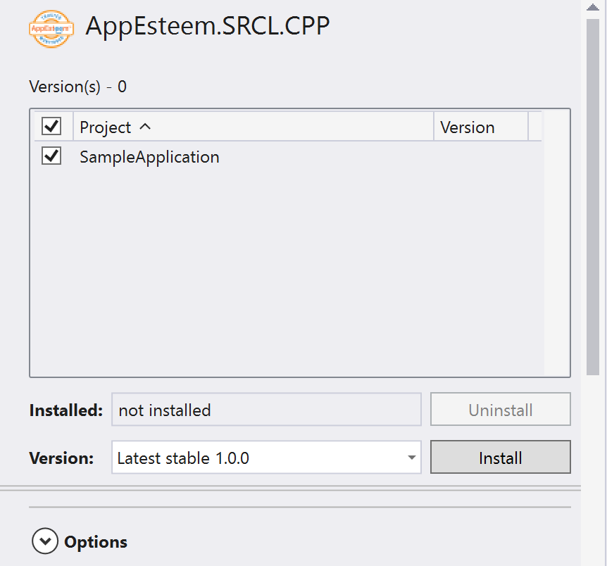

### How to use AppEsteem's Self Regulating Client Library
**Pre requisites:** *Visualstudio_ 2010* and *later*

> Please follow instructions below to download and link vendor application to SRCL library:

_**Obtaining Seal from AppEsteem**_
1) Login to AppEsteem portal <https://customer.appesteem.com/>
2) Register your company (you only need to do it once) :
* Click REGISTER button on the "You do not have any Company registered" banner. 

* Enter company Name and Website. Click Register button. Upon successful registration you will be navigated to AppEsteem Portal page.

3) Register your application:
* Under COMMIT click on “Manage my apps”.

* There are two ways to start application registration:
  - If this is your first application you will see the banner "No apps have been registered for Sample Company". Click on ADD NEW APP button.

  

  - Othervise you will see the list of registered applications. Click on the "+" button.

  

* Enter Application Name and Application Type and click Submit button.

* After successful registration you will see "Success!" message. Click on "Manage your applications" link.

* Registered application will appear in "Apps In Development" table.

4) Request an AppEsteem seal by clicking on the “Request Seal” button for desired application. This will generate an email to AppEstseem.
5) You will receive an email from AppEsteem requesting additional information about the application within 2 business days.
6) After receiving all the necessary information AppEsteem will provide you the seal (registration.cpp).

_**Downloading AppEsteem SRCL Library**_
1) From visual studio select menu Tools -> NuGet Package Manager ->
 Manage Nuget Package for solution.
2) Select Browse and search for appesteem.You should be able to see AppEsteem.SRCL.CPP listed.

    
3) Select the application to be linked to AppEsteem SRCL Library and click install button.

    
5) A screen will be displayed to Review changes and to proceed with installation.

    
6) Select OK button to continue.
7) We can now see the message on the screen that the installation is  finished.

    
8) From NuGet package solution we can now see the AppEsteem SRCL checked and uninstall button enabled.

    
9) Include the seal(registration.cpp) obtained from AppEsteem to the application source files.
10) Build the application with seal included.
11) Now when the application is run SRCL library should be able to send notifications/Telemetry to  the server.

*Known issues:*

 1) Error while building your application :
"unexpected end of file while looking for while looking for precompiled header". 

    *Steps to resolve:* If you are using precompiled headers in your project, configure precompiled headers not using Precompiled Headers.
 _To do this go to Visual studio Solution Explorer right click on your application and select properties -> C++ tab -> Precompiled Headers -> Precompiled Header and select Not Using Precompiled Headers._