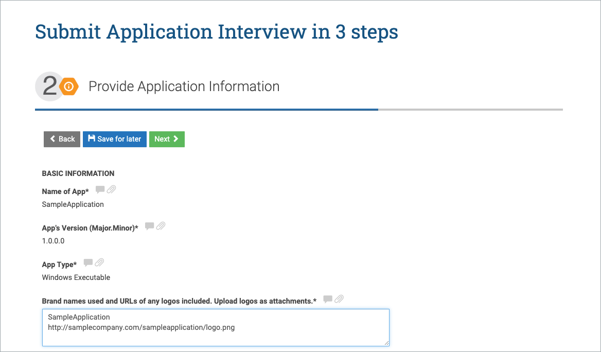

# Register an Application with AppEsteem®

 Registering an application with AppEsteem allows us to inform you and others with information related to your application.

1. There are two ways to start the application registration. If this is your first application click the **Register an App** button on the portal home page.

    

    If this is not your first application, click the **See All Apps** button (or click the ">" button for Applications under the THINGS YOU CAN DO section). You will see the list of registered applications. Click on the **Register an App** button.

    

    

2. Fill in Application Information fields.

    

    if you checked the *"Is this app a white label distributed by another company?"* checkbox, you would need to provide Distributing Company Name. 

     

3. Choose one of the level of Services by clicking the **Select** button under the PREMIUM SUPPORT,  or under BASIC SUPPORT, or under INDIVIDUAL REVIEW. Click the **Register Application** to continue registration.

    

4. Submit application interview. Upload application executables, enter Version Change Log and click the **Next** button

    

5. Provide application information and click on the **Next** button.

    

    

6. Check checkboxes for Attest, enter your Name and click the **Submit** button.

    

    **NOTE:** At any step of the Submit Application Interview, you can click the **Save for later** button. To resume the Application Interview submission later you would need to go to the Application List page and click the *Submit App for Review* link for the correspondent application version.

    

7. After the successful registration you will be redirected to the Application List page. The registered application will appear in this list.

    
