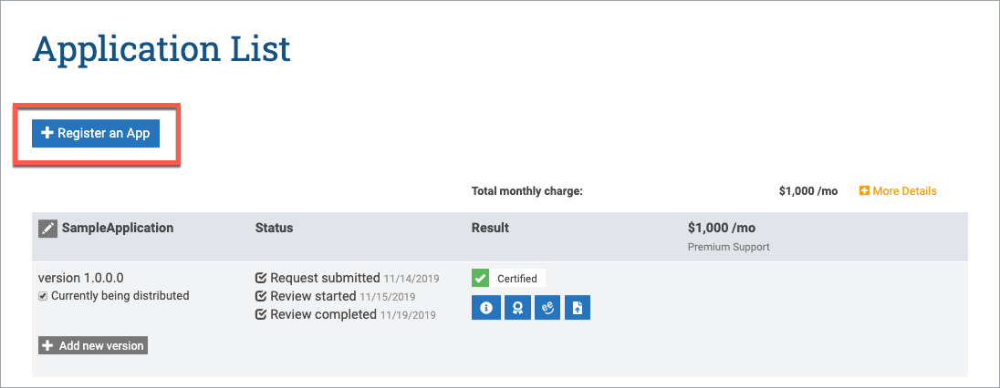
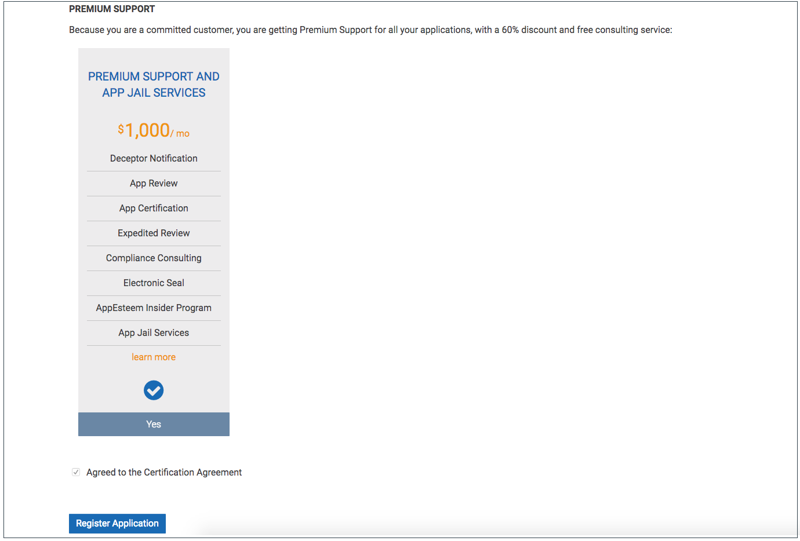
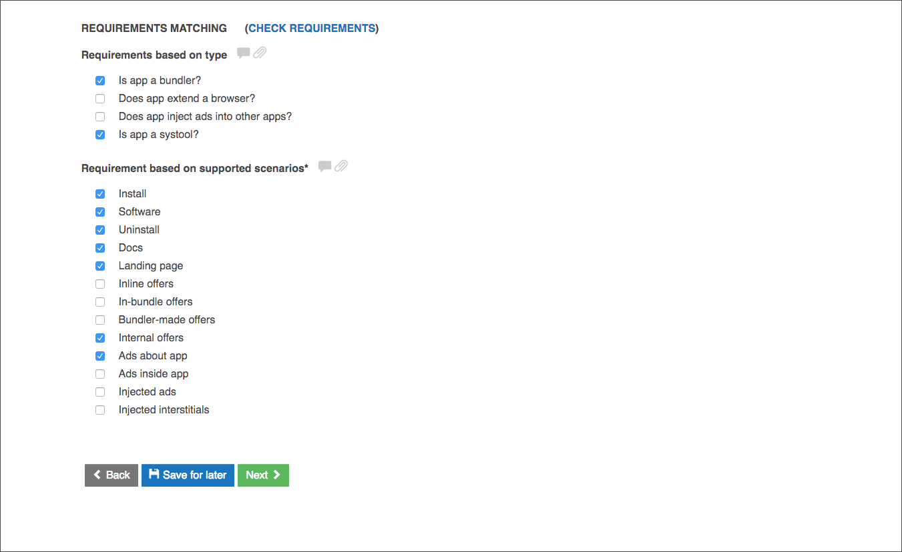
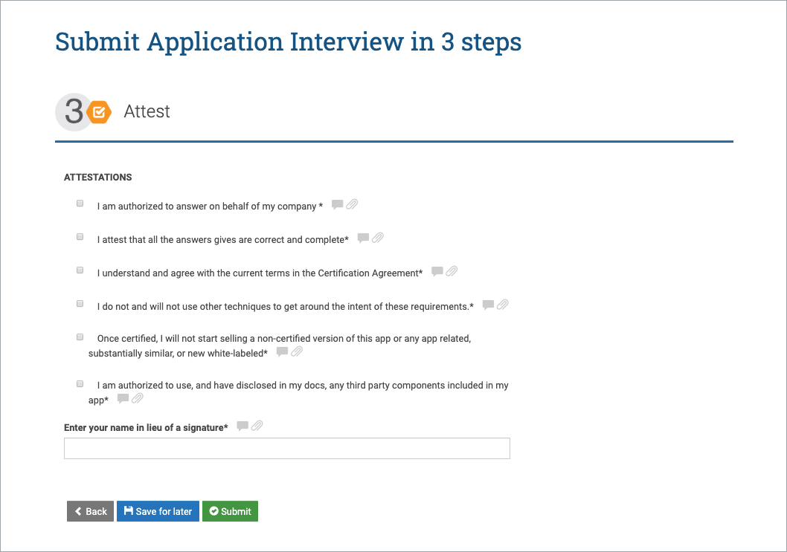
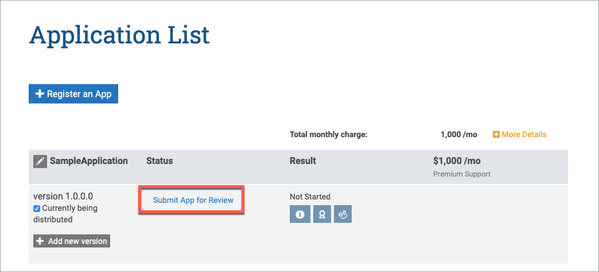
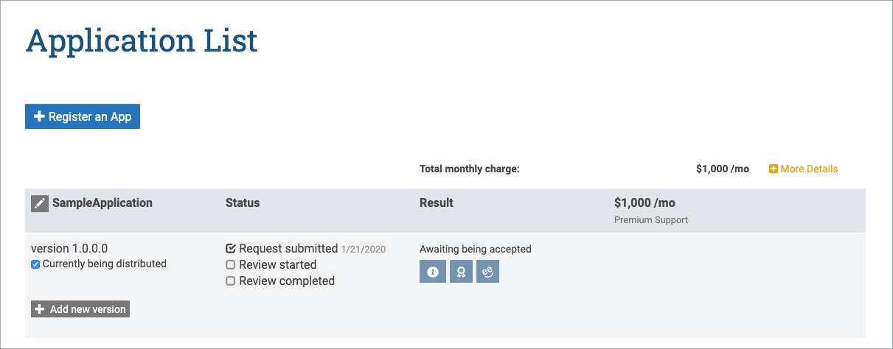

# Register an Application with AppEsteem®

 Registering an application with AppEsteem allows us to inform you and others with information related to your application.

1. There are two ways to start the application registration. If this is your first application click the “Register an App” button on the portal home page.

    

    If this is not your first application, click the **See All Apps** button (or click the ">" button for Applications under the THINGS YOU CAN DO section). You will see the list of registered applications. Click on the **Register an App** button.

    

    

2. Enter Application Name, Application Latest Version, Application Landing Page and Application Type.

    

3. Next step depends on the commitment level of your company. If your company has "Explore" commitment level, you will see four categories of service. Choose one of the  Premium Support by clicking the Select button under the PREMIUM SUPPORT or under PREMIUM SUPPORT AND APP JAIL SERVICES. Click the **Register Application** to continue registration.

    

   If your company has "Committed" commitment level, you will see only one category of service - PREMIUM SUPPORT AND APP JAIL SERVICES. Click the **Register Application** button to continue registration.

    

4. Request Application Certification. Upload application executables and click the **Next** button

    

5. Provide application information and click on the **Next** button.

    

    

6. Check checkboxes for Attest, enter your Name and click the **Submit** button.

    

    **NOTE:** At any step of the Request Application Certification, you can click the **Save for later** button. To resume the Certification later you would need to go to the Application List page and click the *Request App Review* link for the correspondent application version.

    

7. After the successful registration you will be redirected to the Application List page. The registered application will appear in this list.

    
