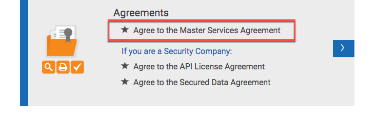
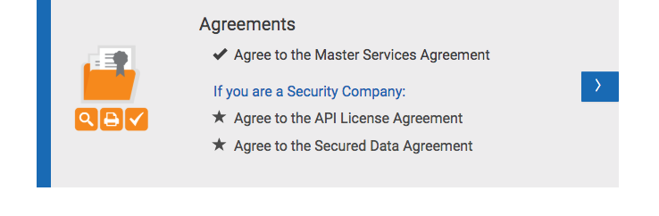

# Register you Company on the AppEsteem® customer portal

This page will guide you through the creation of a company on AppEsteem's customer portal. Creating a company is done one time, then multiple applications can be created that are associated with the company.

1. To register your company, click the **Provide Company Info** button under the *"We need your Company Information"* message

    

2. Enter the company Name, Website, Phone and Major Brands

    

3. Choose Commitment Level and click the Register button. Upon successful registration you will be navigated to the AppEsteem Portal page.

    

4. Next step is to sign the Master Services Agreement. Under Agreements click on the *“Agree to the Master Services Agreement”*

    

5. Read the Master Services Agreement by clicking on the **Master Services Agreement** link, check the *"I agree with the Master Services Agreement"* checkbox and click the **Next** button.

    

6. Upon successfully signing the Master Services Agreement you will see the check mark next to the *"Agree to the Master Services Agreement”* link on the Portal page.

    
